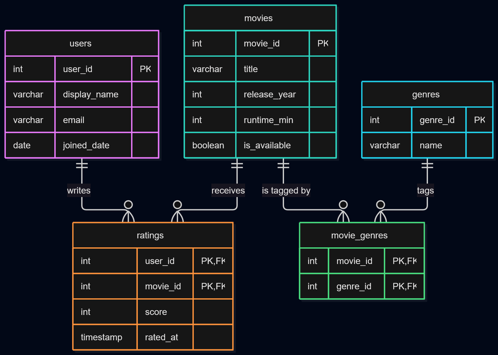

# EX603 Project: Movie Database

**Name:** Sinan Rahman  
**Chosen theme:** Movie / TV

This is a a relational database for a large-scale application where users rate movies and movies are classified by genre.

## Domain:  

The platform holds a catalogue of films and television titles and a population of registered users. The system has a catalogue of titles, and users who watch them and record what they thought. A user browses the catalogue, rates a title from
1 to 10, and can filter what they see by genre. The value of the platform comes
from aggregation where a large number of ratings could describe a film well enough to recommend it to someone else.

The design is driven by the questions the platform has to answer. What is the
average score for a given title, and how many ratings is that average based on?
Which titles in a genre rate highest? What has a particular user rated, and how
recently? Which titles are currently available? Each of those questions shaped
either an attribute or a constraint in the schema.

## Schema:

Five relations:

| Role | Relation |
|---|---|
| actor | `users` |
| producer | `movies` |
| event | `ratings` |
| catalog | `genres` |
| junction | `movie_genres` |

Attribute definitions: [schema/schema-definition.md](schema/schema-definition.md)
Constraints and justifications: [schema/constraints.md](schema/constraints.md)
Modelling justification and reflection: [analysis/unit1.md](analysis/unit1.md)

## Query catalogue:

## Technical highlights:

## What I would do differently:

## Video presentation:

## How to run:

## AI Usage 
Assistance with Markdown formatting, mermaid.live ERD formatting, insight for deciding domains like movie release year,
insight into other approaches designers could make, specifically about my primary key.
